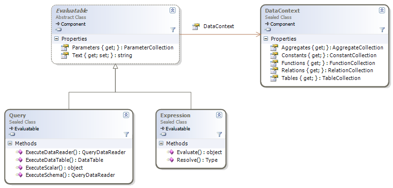

# Getting Started

## Overview

NQuery mainly provides three classes: `Query`, `Expression` and `DataContext`.



The `DataContext` represents something like a scope in which you can place
tables, relations, functions, named constants and aggregates.

`Query` can be used to execute a `SELECT` statement against a data context.
`Expression` can be used in scenarios where you only need an expression instead
of a full query. This can be especially useful for features like searching,
filtering or field mapping.

Both `Query` and `Expression` contain a parameter collection that is very
similar to the parameter collection used by .NET database classes. Changing
parameter values does not require the `Query` or `Expression` to be recompiled.

See sections [Expressions](#expressions) and [Queries](#queries) to see how
these classes are actually used.

## Expressions

Below is an example of two expressions that are used to:

1. Filter a list of type to include only types that are either abstract or not
a class and have more than 50 members

2. Create string from a type that shows the type's fullname and base type's
fullname

```CSharp
using System;
using System.Collections.Generic;
using System.Data;
using System.Reflection;

using NQuery;

namespace NQueryQuickDemo2
{
    class Program
    {
        static void Main(string[] args)
        {
            // Get a lists with all types
            Console.WriteLine("Loading types...");
            List<Type> typeList = new List<Type>();
            foreach (Assembly assembly in AppDomain.CurrentDomain.GetAssemblies())
                typeList.AddRange(assembly.GetTypes());

            // Create an empty data context
            DataContext dataContext = new DataContext();
            
            // Create expression to filter types
            Expression filterExpr = new Expression("(@Type.IsAbstract OR NOT @Type.IsClass) AND @Type.GetMembers().Length > 50", dataContext);
            filterExpr.Parameters.Add("@Type", typeof(Type));

            // Create expression to create a value from a type
            Expression valueExpr = new Expression("@Type.FullName + COALESCE(' : ' + @Type.BaseType.FullName, '')", dataContext);
            valueExpr.Parameters.Add("@Type", typeof(Type));

            foreach (Type type in typeList)
            {
                filterExpr.Parameters["@Type"].Value = type;
                valueExpr.Parameters["@Type"].Value = type;

                bool filterResult = Convert.ToBoolean(filterExpr.Evaluate());
                string valueResult = Convert.ToString(valueExpr.Evaluate());

                if (filterResult)
                    Console.WriteLine(valueResult);
            }
        }
    }
}
```

## Queries

Below is an example of a query that joins a list of types with their type
members and groups them by assembly name and member type.

```CSharp
using System;
using System.Collections.Generic;
using System.Data;
using System.Reflection;

using NQuery;

namespace NQueryQuickDemo1
{
    class Program
    {
        static void Main(string[] args)
        {
            // Get a lists with all types and all members

            Console.WriteLine("Loading types...");
            List<Type> typeList = new List<Type>();
            List<MemberInfo> memberList = new List<MemberInfo>();
            foreach (Assembly assembly in AppDomain.CurrentDomain.GetAssemblies())
            {
                Type[] types = assembly.GetTypes();
                typeList.AddRange(types);

                foreach (Type t in types)
                    memberList.AddRange(t.GetMembers());
            }

            // Create data context containing the tables "Types" and "Members"

            DataContext dataContext = new DataContext();
            dataContext.Tables.Add(typeList.ToArray(), "Types");
            dataContext.Tables.Add(memberList.ToArray(), "Members");

            Query query = new Query(dataContext);
            query.Text = @"
                SELECT  t.Assembly.ManifestModule.Name AS AssemblyName,
                        m.MemberType.ToString() AS MemberType,
                        COUNT(*) AS MemberCount
                FROM    Types t
                            INNER JOIN Members m ON m.DeclaringType.AssemblyQualifiedName = t.AssemblyQualifiedName
                GROUP   BY t.Assembly.ManifestModule.Name, m.MemberType
            ";

            // Execute the query and get a DataTable containing the result

            Console.WriteLine("Executing query...");
            DataTable result = query.ExecuteDataTable();
            result.TableName = "Types";
            result.WriteXml(Console.Out);
        }
    }
}
```